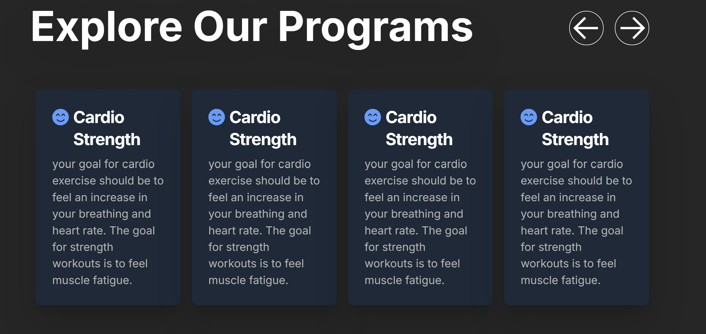
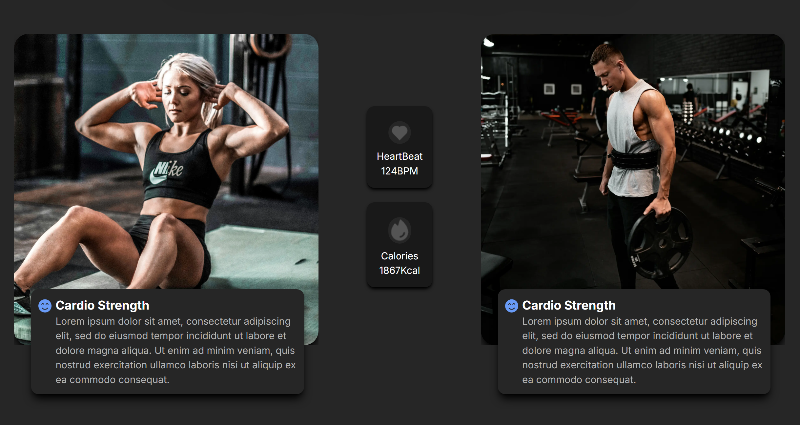

# 🏋️‍♂️ Gym Workout Tracker

   

## 📌 Project Overview
The **Gym Workout Tracker** is a web application designed to help fitness enthusiasts log, track, and analyze their workouts efficiently. The application provides users with a seamless experience for planning exercises, tracking progress, and setting fitness goals.


--

--


## 🚀 Features
### User Features
- 📝 **Log Workouts**: Add exercises, sets, reps, and weights.
- 📅 **Workout History**: View past workout logs to track progress.
- 📊 **Progress Tracking**: Visual charts displaying workout performance.
- ⏲️ **Timers & Reminders**: Built-in rest timer for workouts.
- 🎯 **Goal Setting**: Set weekly or monthly fitness goals.
- 🏆 **Achievements**: Unlock badges for consistency and milestones.

### Technical Features
- 🌐 **Next.js & React**: Optimized for fast performance and seamless navigation.
- 🎨 **Tailwind CSS**: Responsive and modern UI design.
- 💾 **Node.js & Express**: Backend for handling user authentication and workout data.
- 🔒 **Authentication**: Secure login and user sessions using JWT.
- 📂 **MongoDB or Firebase** (Optional): Store user workout data securely.

## 🛠️ Tech Stack
- **Frontend**: Next.js, React.js, Tailwind CSS, JavaScript (ES6)
- **Backend**: Node.js, Express.js
- **Database**: MongoDB (or Firebase for real-time data)
- **Authentication**: JWT for secure login and user sessions

## 📥 Installation & Setup

### 1️⃣ Clone the Repository
```bash
git clone https://github.com/your-username/gym-workout-tracker.git
cd gym-workout-tracker
```

### 2️⃣ Install Dependencies
```bash
# Install frontend dependencies
npm install

# Install backend dependencies
cd server
npm install
```

### 3️⃣ Run the Application
```bash
# Start the frontend (Next.js)
npm run dev

# Start the backend (Node.js & Express)
cd server
npm start
```

## 📡 API Endpoints
| Endpoint | Method | Description |
|----------|--------|-------------|
| `/api/workouts` | GET | Retrieve all workouts |
| `/api/workouts/{id}` | GET | Get a specific workout |
| `/api/workouts` | POST | Log a new workout |
| `/api/workouts/{id}` | PUT | Update a workout entry |
| `/api/workouts/{id}` | DELETE | Remove a workout |
| `/api/auth/register` | POST | Register a new user |
| `/api/auth/login` | POST | Authenticate user and generate JWT token |

## 🔐 Security Implementation
- **JWT-based authentication** for user login.
- **Role-based access control** to restrict workout modifications.
- **Encrypted user data** for privacy and security.

## 📸 Screenshots
(Include UI screenshots if applicable)

## 🚀 Future Enhancements
- 📌 **Workout Templates**: Predefined workout plans for beginners to advanced users.
- 📊 **Advanced Analytics**: AI-based performance tracking and insights.
- 📱 **Mobile App Integration**: React Native version for mobile tracking.
- 🤝 **Social Features**: Share workout progress with friends.

## 🤝 Contribution Guidelines
1. Fork the repository.
2. Create a new branch for your feature.
3. Submit a pull request with detailed documentation.

## 📜 License
This project is licensed under the MIT License.

---
**⭐ If you like this project, don't forget to star the repository!**
